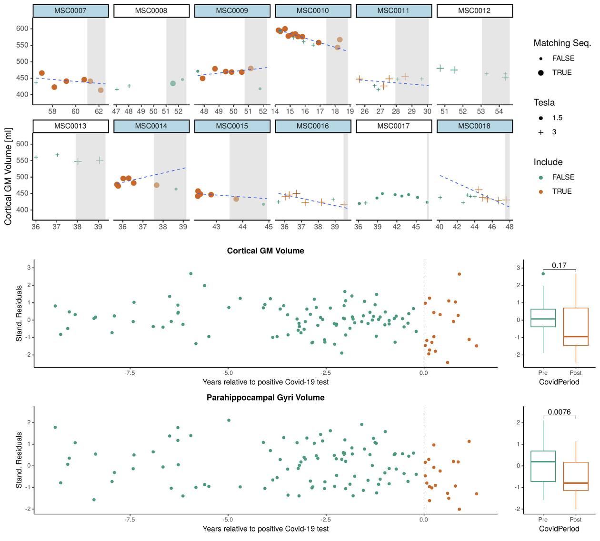

# About BrainAtrophyRate



Analysis scripts related to the corresponding [publication](https://doi.org/10.1111/cns.14050):

```
Rebsamen M, Friedli C, Radojewski P, Diem L, Chan A, Wiest R, Salmen A, Rummel C, Hoepner R.
Multiple sclerosis as a model to investigate SARS-CoV-2 effect on brain atrophy.
CNS Neuroscience & Therapeutics. 2023; 29: 538-543. https://doi.org/10.1111/cns.14050
```
